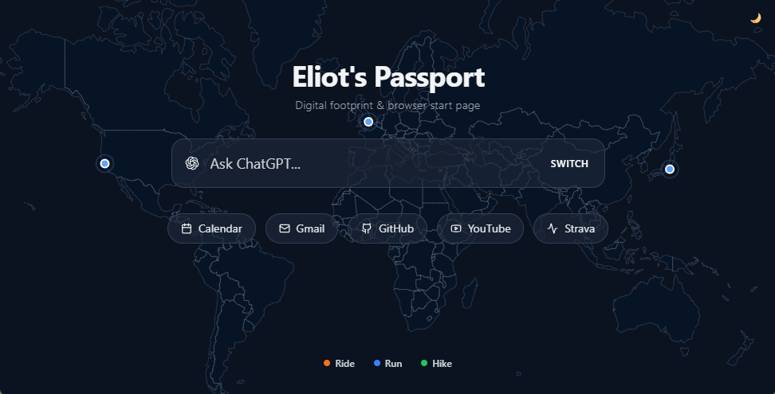

<p align="center">
  
</p>
<h1 align="center">🌍 Eliot's Passport</h1>
<p align="center">Digital footprint & browser start page</p>


## 🚀 Quick Start

- Prerequisite: Node.js (v18+) installed

```bash
git clone git@github.com:eliotziqi/passport.git
npm install
npm run dev
```

## ⚙️ Customization Guide
### Start Page Bookmarks
You can modify the bookmark link for the start page in the `APP_DATA.bookmarks` array within `services/mockData.ts`:

```typescript
bookmarks: [
  { title: 'Gmail', url: 'https://mail.google.com' },
  { title: 'GitHub', url: 'https://github.com' },
  { ... }
]
```

### Map Data
The map visualizes your outdoor activities and memorable locations. To customize it with your own data, follow these steps:

#### 1. Structure (`types.ts`)
```typescript
interface Activity {
  id: string;
  type: 'Run' | 'Ride' | 'Hike'; // determines line color
  name: string;
  date: string;
  coordinates: [number, number][]; // [longitude, latitude] array
}

interface MemoryAnchor {
  id: string;
  coordinate: [number, number]; // [longitude, latitude]
  title: string;
  date: string;
  note: string;
  imageUrl?: string; // image URL
}
```

#### 2. Source
Currently, the map displays mock data from `services/mockData.ts`. To create your own Passport, you need to replace it with real activity data.

#### 3. Data Preparation
Due to Strava API limitations and CORS issues, it is recommended to use an **offline preprocessing** approach:

1.  **Export Data**: Export your personal archive from the Strava website to obtain all `.gpx` or `.fit` files.
2.  **Conversion Script (Python Example)**:
    Write a Python script that uses `gpxpy` to read the files and uses `shapely` or `rdp` libraries for simplification (for performance, it is recommended to compress the track points to 100-500 points per route).
3. **Substitute Data**: Paste the processed JSON array into `services/mockData.ts`, or modify `App.tsx` to load it asynchronously via `fetch('/my-data.json')`.---


## 🔮 Future Plans

*   [ ] **Auto Sync**: Integrate Strava Webhook or GitHub Actions to automatically fetch new activity data and update the JSON file daily
*   [ ] **3D Mode**: Add a toggle button to switch to a 3D globe view using D3-Geo-3D or Three.js
*   [ ] **Timeline Filtering**: Add a slider at the bottom to filter displayed tracks by year/month
